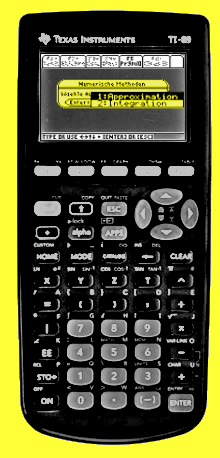

# nummeth - Numerische Methoden zur Approximation und Integration
Applikation zur numerischen Approximation und Integration für den Taschenrechner TI-89.

- Stichworte: Bisection, Regula falsi, Newton, Rechteck-, Trapez-, Tangenten-, Simpson-Verfahren
- Technologie: Taschenrechner TI-89, Programmiersprache TI-Basic.
- 

Schwerpunktfach Physik und Angewandte Mathematik, FS 2005

Maturitätsschule für Erwachsene MSE, Reussbühl
