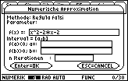

# Numerische Methoden  zur Approximation und Integration
### Programmierung TI-89

#### Semesterarbeit

Schwerpunktfach Physik und Angewandte Mathematik 
Maturitätsschule für Erwachsene MSE, Reussbühl 2005

##### Beschreibung
- Applikation zur numerischen Approximation und Integration auf dem Taschenrechner TI-89.

##### Stichworte
- Approximation: Bisection, Regula falsi, Newton
- Integration: Rechteck-, Trapez-, Tangenten-, Simpson-Verfahren
- Taschenrechner TI-89
- Programmiersprache: TI-BASIC

##### Bericht
- <a target="_blank" href="https://speakerdeck.com/brugr9/numerische-methoden-approximation-und-integration-bericht">Bericht</a> (auf speakerdeck)
